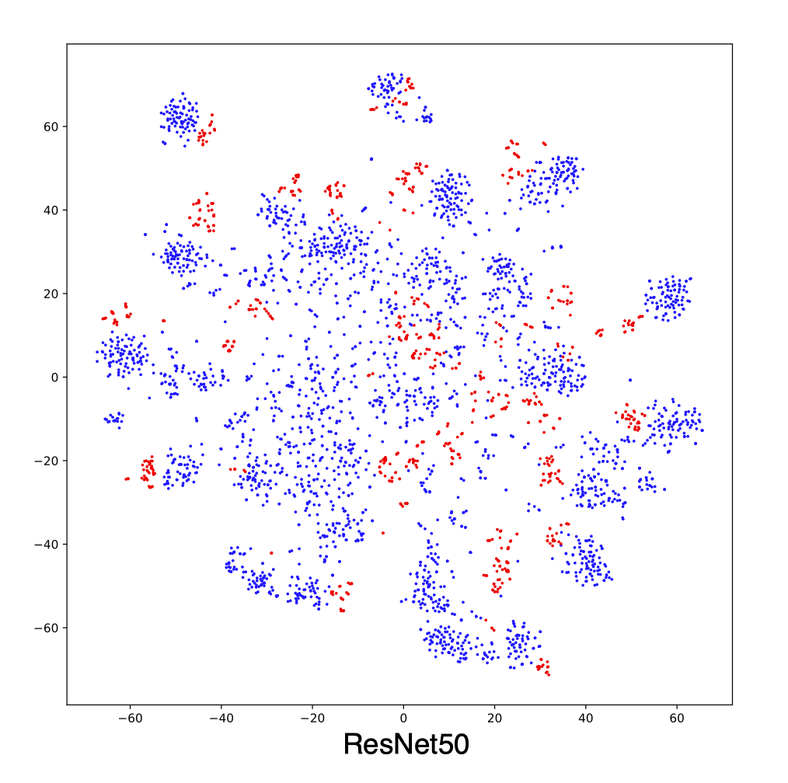
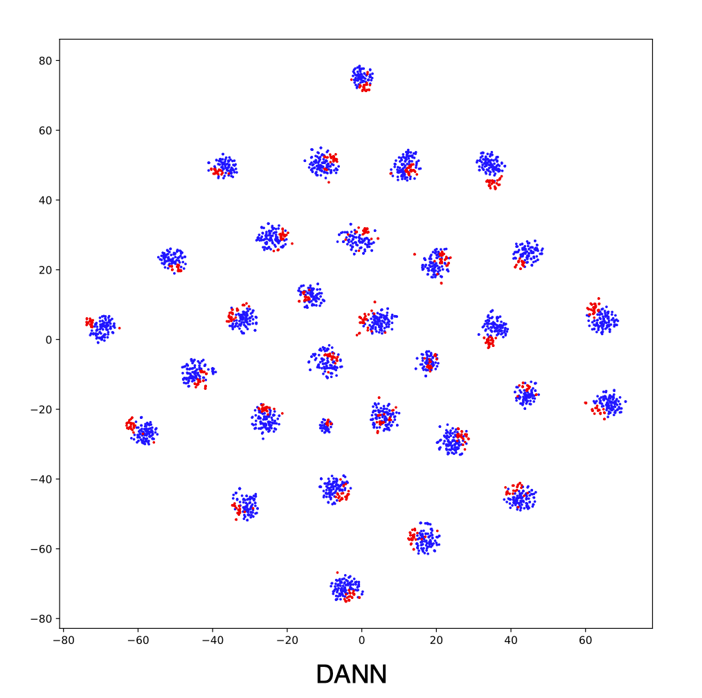
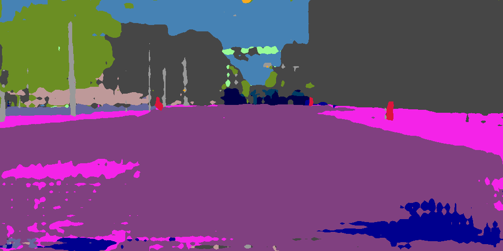
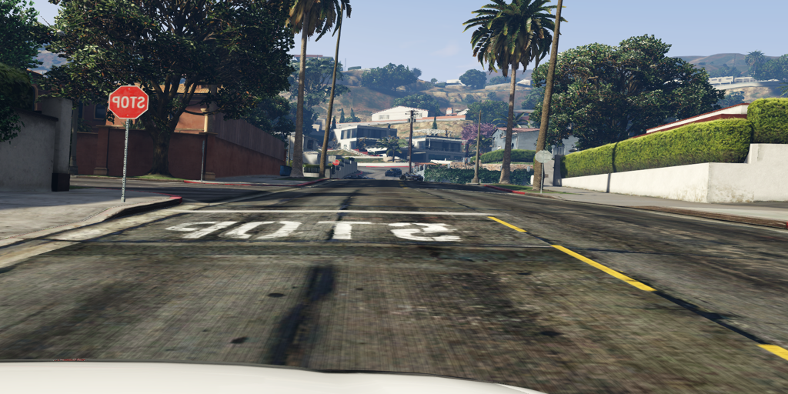

*************
Visualization
*************

How to visualize the representations using t-SNE?
===================================================================

Many algorithms aim at aligning feature representations between ``source`` and ``target`` domain.
Through visualization, you can find and analysis the mis-alignment between different domains. 

After training `DANN`, in directory ``examples/domain_adaptation/image_classification``, run the following command

.. code-block:: shell

    CUDA_VISIBLE_DEVICES=0 python dann.py data/office31 -d Office31 -s A -t W -a resnet50 --epochs 20 --seed 1 --log logs/dann/Office31_A2W --phase analysis

It may take a while, then in directory ``logs/dann/Office31_A2W/visualize``, you can find
``TSNE.png``.

    t-SNE of representations from ResNet50 trained on source domain.

    t-SNE of representations from DANN.

How to visualize the segmentation predictions?
===================================================================
For each segmentation algorithms, we've implemented the visualization code. All you need to do is set ``--debug`` during training.
For instance, in the directory ``examples/domain_adaptation/semantic_segmentation``,

.. code-block:: shell

    CUDA_VISIBLE_DEVICES=0 python source_only.py data/GTA5 data/Cityscapes -s GTA5 -t Cityscapes --log logs/src_only/gtav2cityscapes --debug

Then you can find visualization images in directory ``logs/src_only/gtav2cityscapes/visualize/``.

.. figure:: ../_static/images/visualization/segmentation_image.png
    :width: 400

    Cityscapes image.

    Segmentation predictions.

.. figure:: ../_static/images/visualization/segmentation_label.png
    :width: 400

    Segmentation labels.

Translation model such as CycleGAN will save images by default. Here is the translation results from source style to target style.

    Source images.

.. figure:: ../_static/images/visualization/cyclegan_fake_T.png
    :width: 400

    Source image in target style.

How to visualize the keypoint detection predictions?
===================================================================
For each keypoint detection algorithms, we've implemented the visualization code. All you need to do is set ``--debug`` during training.
For instance, in the directory ``examples/domain_adaptation/keypoint_detection``,

.. code-block:: shell

    CUDA_VISIBLE_DEVICES=0 python source_only.py data/RHD data/H3D_crop -s RenderedHandPose -t Hand3DStudio --log logs/baseline/rhd2h3d --debug --seed 0

Then you can find visualization images in directory ``logs/baseline/rhd2h3d/visualize/``.

.. figure:: ../_static/images/visualization/keypoint_detection.jpg
    :width: 300
