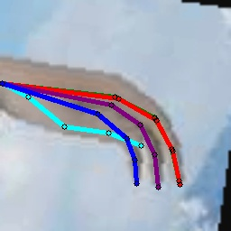

# Unsupervised Domain Adaptation for Keypoint Detection
It’s suggested to use **pytorch==1.7.1** and torchvision==0.8.2 in order to better reproduce the benchmark results.

## Dataset
Following datasets can be downloaded automatically:

- [Rendered Handpose Dataset](https://lmb.informatik.uni-freiburg.de/resources/datasets/RenderedHandposeDataset.en.html)
- [Hand-3d-Studio Dataset](https://www.yangangwang.com/papers/ZHAO-H3S-2020-02.html)
- [FreiHAND Dataset](https://lmb.informatik.uni-freiburg.de/projects/freihand/)
- [Surreal Dataset](https://www.di.ens.fr/willow/research/surreal/data/)
- [LSP Dataset](http://sam.johnson.io/research/lsp.html)

You need to prepare following datasets manually if you want to use them:
- [Human3.6M Dataset](http://vision.imar.ro/human3.6m/description.php)

and prepare them following [Documentations for Human3.6M Dataset](/common/vision/datasets/keypoint_detection/human36m.py).

## Supported Methods

Supported methods include:

- [Regressive Domain Adaptation for Unsupervised Keypoint Detection (RegDA, CVPR 2021)](http://ise.thss.tsinghua.edu.cn/~mlong/doc/regressive-domain-adaptation-cvpr21.pdf)

## Experiment and Results

The shell files give the script to reproduce the results with specified hyper-parameters.
For example, if you want to train RegDA on RHD->H3D, use the following script

```shell script
# Train a RegDA on RHD -> H3D task using PoseResNet.
# Assume you have put the datasets under the path `data/RHD` and  `data/H3D_crop`, 
# or you are glad to download the datasets automatically from the Internet to this path
CUDA_VISIBLE_DEVICES=0 python regda.py data/RHD data/H3D_crop \
    -s RenderedHandPose -t Hand3DStudio --finetune --seed 0 --debug --log logs/regda/rhd2h3d
```

### RHD->H3D accuracy on ResNet-101

| Methods     | MCP  | PIP  | DIP  | Fingertip | Avg  |
|-------------|------|------|------|-----------|------|
| ERM | 67.4 | 64.2 | 63.3 | 54.8      | 61.8 |
| RegDA       | 79.6 | 74.4 | 71.2 | 62.9      | 72.5 |
| Oracle      | 97.7 | 97.2 | 95.7 | 92.5      | 95.8 |

### Surreal->Human3.6M accuracy on ResNet-101

| Methods     | Shoulder | Elbow | Wrist | Hip  | Knee | Ankle | Avg  |
|-------------|----------|-------|-------|------|------|-------|------|
| ERM | 69.4     | 75.4  | 66.4  | 37.9 | 77.3 | 77.7  | 67.3 |
| RegDA       | 73.3     | 86.4  | 72.8  | 54.8 | 82.0 | 84.4  | 75.6 |
| Oracle      | 95.3     | 91.8  | 86.9  | 95.6 | 94.1 | 93.6  | 92.9 |

### Surreal->LSP accuracy on ResNet-101

| Methods     | Shoulder | Elbow | Wrist | Hip  | Knee | Ankle | Avg  |
|-------------|----------|-------|-------|------|------|-------|------|
| ERM | 51.5     | 65.0  | 62.9  | 68.0 | 68.7 | 67.4  | 63.9 |
| RegDA       | 62.7     | 76.7  | 71.1  | 81.0 | 80.3 | 75.3  | 74.6 |
| Oracle      | 95.3     | 91.8  | 86.9  | 95.6 | 94.1 | 93.6  | 92.9 |

## Visualization
If you want to visualize the keypoint detection results during training, you should set --debug.

```
CUDA_VISIBLE_DEVICES=0 python erm.py data/RHD data/H3D_crop -s RenderedHandPose -t Hand3DStudio --log logs/erm/rhd2h3d --debug --seed 0
```

Then you can find visualization images in directory ``logs/erm/rhd2h3d/visualize/``.




## TODO
Support methods:  CycleGAN


## Citation
If you use these methods in your research, please consider citing.

```
@InProceedings{RegDA,
    author    = {Junguang Jiang and
                Yifei Ji and
                Ximei Wang and
                Yufeng Liu and
                Jianmin Wang and
                Mingsheng Long},
    title     = {Regressive Domain Adaptation for Unsupervised Keypoint Detection},
    booktitle = {CVPR},
    year = {2021}
}

```
