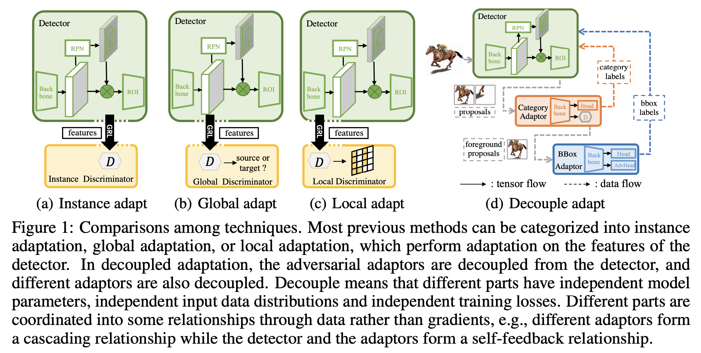
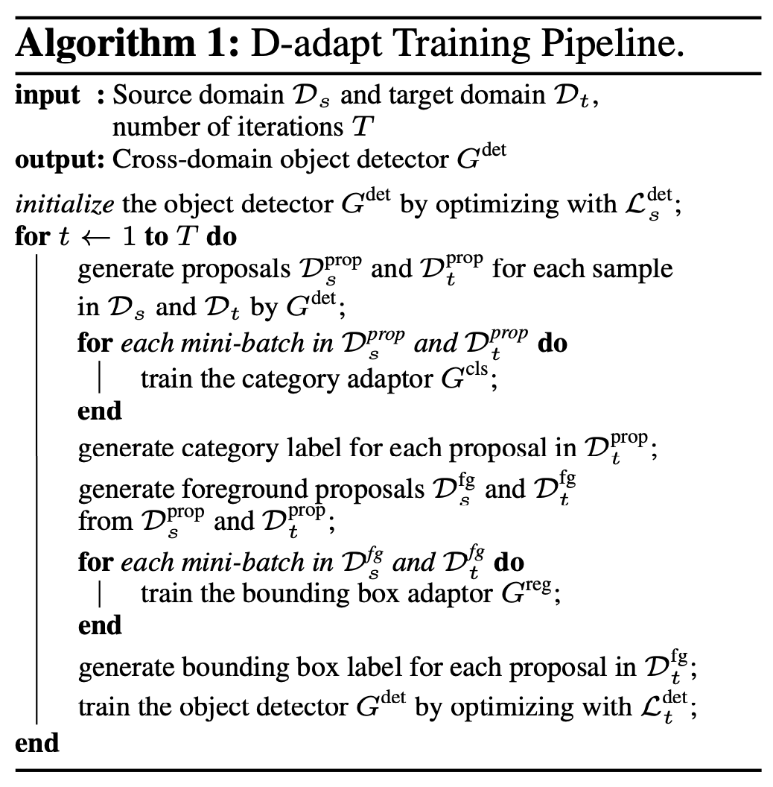

# Decoupled Adaptation for Cross-Domain Object Detection

## Installation
Our code is based on 
- [Detectron latest(v0.6)](https://detectron2.readthedocs.io/en/latest/tutorials/install.html)
- [PyTorch-Image-Models](https://github.com/rwightman/pytorch-image-models)

please install them before usage.

## Method
Compared with previous cross-domain object detection methods, D-adapt decouples the adversarial adaptation from the training of detector.
<div align="center">
	
</div>

The whole pipeline is as follows:
<div align="center">
	
</div>

First, you need to run ``source_only.py`` to obtain pre-trained models. (See source_only.sh for scripts.)
Then you need to run ``d_adapt.py`` to obtain adapted models. (See d_adapt.sh for scripts).
When the domain discrepancy is large, you need to run  ``d_adapt.py`` multiple times.

For better readability, we implement the training of category adaptor in ``category_adaptation.py``, 
implement the training of the bounding box adaptor in``bbox_adaptation.py``,
and  implement the training of the detector and connect the above components in ``d_adapt.py``.
This can facilitate you to modify and replace other adaptors.

We provide independent training arguments for detector, category adaptor and bounding box adaptor.
The arguments of latter two end with ``-c`` and ``-b`` respectively.


## Citation
If you use these methods in your research, please consider citing.

```
@inproceedings{jiang2021decoupled,
  title     = {Decoupled Adaptation for Cross-Domain Object Detection},
  author    = {Junguang Jiang and Baixu Chen and Jianmin Wang and Mingsheng Long},
  booktitle = {ICLR},
  year      = {2022}
}
```
