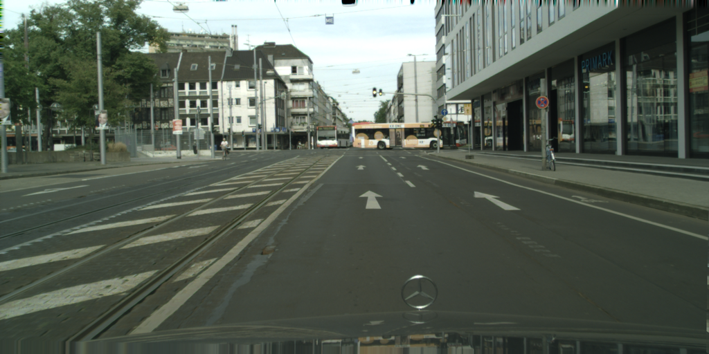
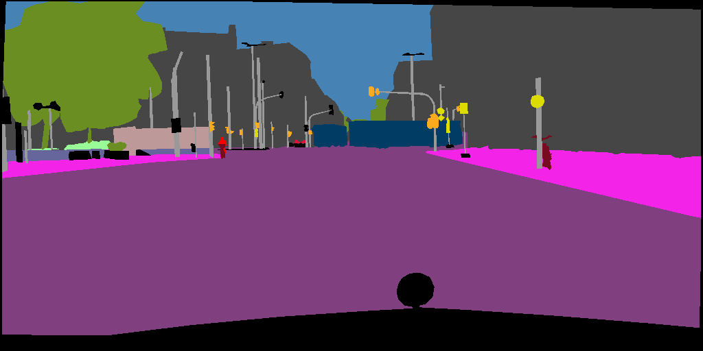

# Unsupervised Domain Adaptation for Semantic Segmentation
It’s suggested to use **pytorch==1.7.1** and torchvision==0.8.2 in order to reproduce the benchmark results.

## Dataset

You need to prepare following datasets manually if you want to use them:
- [Cityscapes](https://www.cityscapes-dataset.com/)
- [GTA5](https://download.visinf.tu-darmstadt.de/data/from_games/)
- [Synthia](https://synthia-dataset.net/)

#### Cityscapes, Foggy Cityscapes
  - Download Cityscapes and Foggy Cityscapes dataset from the [link](https://www.cityscapes-dataset.com/downloads/). Particularly, we use *leftImg8bit_trainvaltest.zip* for Cityscapes and *leftImg8bit_trainvaltest_foggy.zip* for Foggy Cityscapes.
  - Unzip them under the directory like
  
 ```
data/Cityscapes
├── gtFine
├── leftImg8bit
│   ├── train
│   ├── val
│   └── test
├── leftImg8bit_foggy
│   ├── train
│   ├── val
│   └── test
└── ...
```

#### GTA-5
You need to download GTA5 manually from [GTA5](https://download.visinf.tu-darmstadt.de/data/from_games/).
Ensure that there exist following directories before you use this dataset.
 ```
data/GTA5
├── images
├── labels
└── ...
```

#### Synthia
You need to download Synthia manually from [Synthia](https://synthia-dataset.net/).
Ensure that there exist following directories before you use this dataset.
 ```
data/synthia
├── RGB
├── synthia_mapped_to_cityscapes
└── ...
```


## Supported Methods

Supported methods include:

- [Cycle-Consistent Adversarial Networks (CycleGAN)](https://arxiv.org/pdf/1703.10593.pdf)
- [CyCADA: Cycle-Consistent Adversarial Domain Adaptation](https://arxiv.org/abs/1711.03213)
- [Adversarial Entropy Minimization (ADVENT)](https://arxiv.org/abs/1811.12833)
- [Fourier Domain Adaptation (FDA)](https://arxiv.org/abs/2004.05498)

## Experiment and Results

**Notations**
- ``Origin`` means the accuracy reported by the original paper.
- ``mIoU`` is the accuracy reported by `TLlib`.
- ``ERM`` refers to the model trained with data from the source domain.
- ``Oracle`` refers to the model trained with data from the target domain.


### GTA5->Cityscapes mIoU on deeplabv2 (ResNet-101)

| GTA5        | Origin | mIoU | road | sidewalk | building | wall | fence | pole | traffic light | traffic sign | vegetation | terrian | sky  | person | rider | car  | truck | bus  | train | motorbike | bicycle |
|-------------|--------|------|------|----------|----------|------|-------|------|---------------|--------------|------------|---------|------|--------|-------|------|-------|------|-------|-----------|---------|
| ERM | 27.1   | 37.3 | 66.5 | 17.4     | 73.3     | 13.4 | 21.5  | 22.8 | 30.1          | 17.1         | 82.2       | 7.1     | 73.6 | 57.4   | 28.4  | 78.6 | 36.1  | 13.4 | 1.5   | 31.9      | 36.2    |
| AdvEnt      | 43.8   | 43.8 | 89.3 | 33.9     | 80.3     | 24.0 | 25.2  | 27.8 | 36.7          | 18.2         | 84.3       | 33.9    | 81.3 | 59.8   | 28.4  | 84.3 | 34.1  | 44.4 | 0.1   | 33.2      | 12.9    |
| FDA         | 44.6   | 45.6 | 85.5 | 31.7     | 81.8     | 27.1 | 24.9  | 28.9 | 38.1          | 23.2         | 83.7       | 40.3    | 80.6 | 60.5   | 30.3  | 79.1 | 32.8  | 45.1 | 5.0   | 32.4      | 35.2    |
| Cycada      | 42.7   | 47.4 | 87.3 | 35.7     | 83.7     | 31.3 | 24.0  | 32.2 | 35.8          | 30.3         | 82.7       | 32.0    | 85.7 | 60.8   | 31.5  | 85.6 | 39.8  | 43.3 | 5.4   | 29.5      | 44.6    |
| CycleGAN    |        | 47.0 | 88.4 | 41.9     | 83.6     | 34.4 | 23.9  | 32.9 | 35.5          | 26.0         | 83.1       | 36.8    | 82.3 | 59.9   | 27.0  | 83.4 | 31.6  | 42.3 | 11.0  | 28.2      | 40.5    |
| Oracle      | 65.1   | 70.5 | 97.4 | 79.7     | 90.1     | 53.0 | 50.0  | 48.0 | 55.5          | 67.2         | 90.2       | 60.0    | 93.0 | 72.7   | 55.2  | 92.7 | 76.5  | 78.5 | 56.0  | 54.6      | 68.8    |

### Synthia->Cityscapes mIoU on deeplabv2 (ResNet-101)

| Synthia     | Origin | mIoU | road | sidewalk | building | traffic light | traffic sign | vegetation | sky  | person | rider | car  | bus  | motorbike | bicycle |
|-------------|--------|------|------|----------|----------|---------------|--------------|------------|------|--------|-------|------|------|-----------|---------|
| ERM | 22.1   | 41.5 | 59.6 | 21.1     | 77.4     | 7.7           | 17.6         | 78.0       | 84.5 | 53.2   | 16.9  | 65.9 | 24.9 | 8.5       | 24.8    |
| AdvEnt      | 47.6   | 47.9 | 88.3 | 44.9     | 80.5     | 4.5           | 9.1          | 81.3       | 86.2 | 52.9   | 21.0  | 82.0 | 30.3 | 11.9      | 30.2    |
| FDA         | -      | 43.9 | 62.5 | 23.7     | 78.5     | 9.4           | 15.7         | 78.3       | 81.1 | 52.3   | 18.7  | 79.8 | 32.5 | 8.7       | 29.6    |
| Oracle      | 71.7   | 76.6 | 97.4 | 79.7     | 90.1     | 55.5          | 67.2         | 90.2       | 93.0 | 72.7   | 55.2  | 92.7 | 78.5 | 54.6      | 68.8    |

### Cityscapes->Foggy Cityscapes mIoU on deeplabv2 (ResNet-101)

| Foggy       | Origin | mIoU | road | sidewalk | building | wall | fence | pole | traffic light | traffic sign | vegetation | terrian | sky  | person | rider | car  | truck | bus  | train | motorbike | bicycle |
|-------------|--------|------|------|----------|----------|------|-------|------|---------------|--------------|------------|---------|------|--------|-------|------|-------|------|-------|-----------|---------|
| ERM |        | 51.2 | 95.3 | 70.2     | 64.1     | 31.9 | 35.2  | 30.7 | 33.3          | 51.1         | 42.3       | 44.0    | 32.1 | 64.4   | 47.0  | 86.0 | 64.4  | 56.4 | 21.1  | 43.1      | 60.8    |
| AdvEnt      |        | 61.8 | 96.8 | 75.1     | 76.4     | 46.2 | 42.6  | 39.3 | 43.6          | 58.9         | 74.3       | 50.1    | 75.9 | 67.3   | 51.0  | 89.4 | 70.5  | 64.7 | 39.9  | 47.9      | 65.0    |
| FDA         |        | 61.9 | 96.9 | 77.2     | 75.3     | 46.5 | 42.0  | 39.8 | 47.1          | 61.0         | 72.7       | 54.6    | 63.8 | 68.4   | 50.1  | 90.1 | 72.8  | 68.0 | 35.5  | 50.8      | 64.2    |
| Cycada      |        | 63.3 | 96.8 | 75.5     | 79.1     | 38.0 | 40.3  | 42.1 | 48.2          | 61.2         | 76.9       | 52.1    | 77.6 | 68.6   | 51.7  | 90.4 | 71.7  | 70.4 | 43.3  | 52.6      | 65.7    |
| CycleGAN    |        | 66.0 | 97.1 | 77.6     | 84.3     | 42.7 | 46.3  | 42.8 | 47.5          | 61.0         | 84.0       | 55.2    | 83.4 | 69.4   | 51.8  | 90.7 | 73.7  | 76.2 | 54.2  | 50.7      | 65.6    |
| Oracle      |        | 66.9 | 97.4 | 78.6     | 88.1     | 50.7 | 50.5  | 46.2 | 51.3          | 64.4         | 88.1       | 55.3    | 87.4 | 70.9   | 52.7  | 91.6 | 72.4  | 73.2 | 31.8  | 52.2      | 67.4    |

## Visualization
If you want to visualize the segmentation results during training, you should set ``--debug``.

```
CUDA_VISIBLE_DEVICES=0 python source_only.py data/GTA5 data/Cityscapes -s GTA5 -t Cityscapes --log logs/src_only/gtav2cityscapes --debug
```

Then you can find images, predictions and labels in directory ``logs/src_only/gtav2cityscapes/visualize/``.






Translation model such as CycleGAN will save images by default. Here is the source-style images and its translated version.


## TODO
Support methods: AdaptSeg

## Citation
If you use these methods in your research, please consider citing.

```
@inproceedings{CycleGAN,
    title={Unpaired Image-to-Image Translation using Cycle-Consistent Adversarial Networks},
    author={Zhu, Jun-Yan and Park, Taesung and Isola, Phillip and Efros, Alexei A},
    booktitle={ICCV},
    year={2017}
}

@inproceedings{cycada,
    title={Cycada: Cycle-consistent adversarial domain adaptation},
    author={Hoffman, Judy and Tzeng, Eric and Park, Taesung and Zhu, Jun-Yan and Isola, Phillip and Saenko, Kate and Efros, Alexei and Darrell, Trevor},
    booktitle={ICML},
    year={2018},
}

@inproceedings{Advent,
    author = {Vu, Tuan-Hung and Jain, Himalaya and Bucher, Maxime and Cord, Matthieu and Perez, Patrick},
    title = {ADVENT: Adversarial Entropy Minimization for Domain Adaptation in Semantic Segmentation},
    booktitle = {CVPR},
    year = {2019}
}

@inproceedings{FDA,
    author    = {Yanchao Yang and
               Stefano Soatto},
    title     = {{FDA:} Fourier Domain Adaptation for Semantic Segmentation},
    booktitle = {CVPR},
    year = {2020}
}
```
