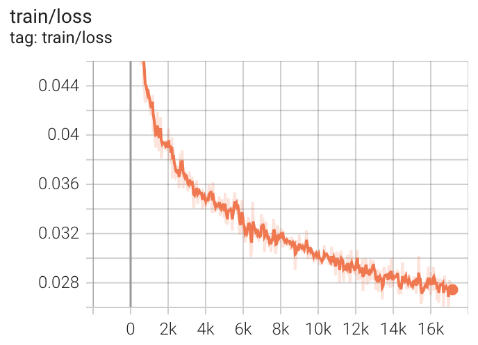

# Unsupervised Domain Adaptation for WILDS (Molecule classification)

## Installation

It's suggested to use **pytorch==1.10.1** in order to reproduce the benchmark results.

Then, you need to run

```
pip install -r requirements.txt
```

At last, you need to install torch_sparse following `https://github.com/rusty1s/pytorch_sparse`.

## Dataset

Following datasets can be downloaded automatically:

- [OGB-MolPCBA (WILDS)](https://wilds.stanford.edu/datasets/)

## Supported Methods

TODO

## Usage

The shell files give all the training scripts we use, e.g.

```
CUDA_VISIBLE_DEVICES=0 python erm.py data/wilds --lr 3e-2 -b 4096 4096 --epochs 200 \
  --seed 0 --deterministic --log logs/erm/obg_lr_0_03_deterministic
```

## Results

### Performance on WILDS-OGB-MolPCBA (GIN-virtual)

| Methods | Val Avg Precision | Test Avg Precision | GPU Memory Usage(GB)|
| --- | --- | --- | --- |
| ERM | 29.0 | 28.0 | 17.8 |

### Visualization

We use tensorboard to record the training process and visualize the outputs of the models.

```
tensorboard --logdir=logs
```


