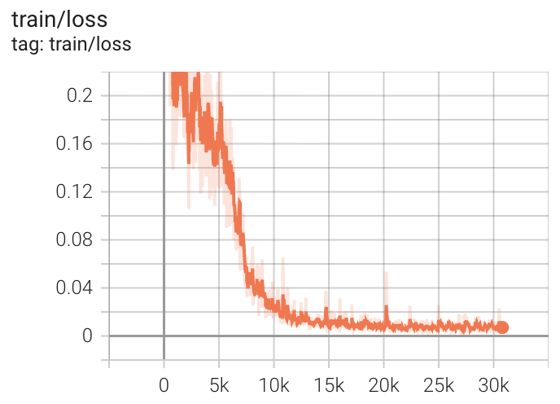

# Unsupervised Domain Adaptation for WILDS (Image Regression)

## Installation

It's suggested to use **pytorch==1.10.1** in order to reproduce the benchmark results.

You need to install apex following `https://github.com/NVIDIA/apex`. Then run

```
pip install -r requirements.txt
```

## Dataset

Following datasets can be downloaded automatically:

- [PovertyMap (WILDS)](https://wilds.stanford.edu/datasets/)

## Supported Methods

TODO

## Usage

Our code is based
on [https://github.com/NVIDIA/apex/edit/master/examples/imagenet](https://github.com/NVIDIA/apex/edit/master/examples/imagenet)
. It implements Automatic Mixed Precision (Amp) training of popular model architectures, such as ResNet, AlexNet, and
VGG, on the WILDS dataset.  
Command-line flags forwarded to `amp.initialize` are used to easily manipulate and switch between various pure and mixed
precision "optimization levels" or `opt_level`s.  
For a detailed explanation of `opt_level`s, see the [updated API guide](https://nvidia.github.io/apex/amp.html).

The shell files give all the training scripts we use, e.g.

```
CUDA_VISIBLE_DEVICES=0 python erm.py data/wilds --split-scheme official --fold A \
  --arch 'resnet18_ms' --lr 1e-3 --epochs 200 -b 64 64 --opt-level O1 --deterministic --log logs/erm/poverty_fold_A
```

## Results

### Performance on WILDS-PovertyMap (ResNet18-MultiSpectral)

| Method | Val Pearson r | Test Pearson r | Val Worst-U/R Pearson r | Test Worst-U/R Pearson r | GPU Memory Usage(GB) |
| --- | --- | --- | --- | --- | --- |
| ERM | 0.80 | 0.80 | 0.54 | 0.50 | 3.5 |

### Distributed training

We uses `apex.parallel.DistributedDataParallel` (DDP) for multiprocess training with one GPU per process.

```
CUDA_VISIBLE_DEVICES=0,1 python -m torch.distributed.launch --nproc_per_node=2 erm.py /data/wilds --arch 'resnet18_ms' \
    --opt-level O1 --deterministic --log logs/erm/poverty --lr 1e-3 --wd 0.0 --epochs 200 --metric r_wg --split_scheme official -b 64 64 --fold A
```

### Visualization

We use tensorboard to record the training process and visualize the outputs of the models.

```
tensorboard --logdir=logs
```

