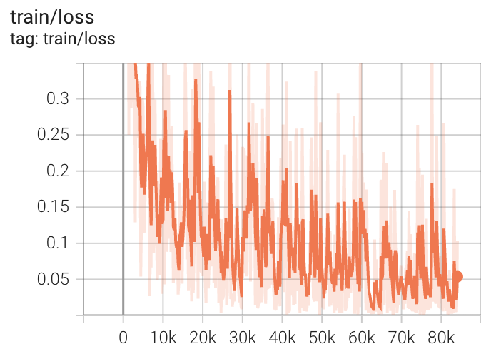
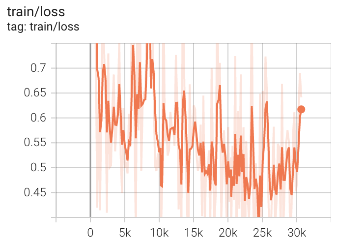

# Unsupervised Domain Adapatation for WILDS (Text Classification)

## Installation
It's suggeste to use **pytorch==1.10.1** in order to reproduce the benchmark results.

You need to run
```
pip install -r requirements.txt
```

## Dataset

Following datasets can be downloaded automatically:
- [CivilComments (WILDS)](https://wilds.stanford.edu/datasets/)
- [Amazon (WILDS)](https://wilds.stanford.edu/datasets/)

## Supported Methods

TODO

## Usage
The shell files give all the training scripts we use, e.g.
```
CUDA_VISIBLE_DEVICES=0 python erm.py /data/wilds -d "civilcomments" --lr 1e-05 --deterministic \
    --log logs/erm/civilcomments --unlabeled-list "extra_unlabeled" --metric "acc_wg" --seed 0 \
    --max-token-length 300 --wd 0.01 --uniform-over-groups --groupby-fields y black
```

## Results

### Performance on WILDS-CivilComments (DistilBert)
| Methods | Val Avg Acc | Val Worst-Group Acc | Test Avg Acc | Test Worst-Group Acc | GPU Memory Usage(GB)|
| --- | --- | --- | --- | --- | --- |
| ERM | 89.2 | 67.7 | 88.9 | 68.5 | 6.4 |

### Performance on WILDS-Amazon (DistilBert)
| Methods | Val Avg Acc | Test Avg Acc | Val 10% Acc | Test 10% Acc | GPU Memory Usage(GB)|
| --- | --- | --- | --- | --- | --- |
| ERM | 72.6 | 71.6 | 54.7 | 53.8 | 12.8 |


### Visuialization
We use tensorboard to record the training process and visualize the outputs of the models. 
```
tensorboard --logdir=logs
```
#### WILDS-CivilComments


#### WILDS-Amazon
