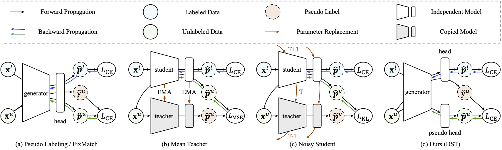

# DST: Debiased Self-Training

Code release of paper [Debiased Self-Training for Semi-Supervised Learning](https://arxiv.org/abs/2202.07136)
(NeurIPS 2022)



**Note**

Here we release code and benchmark results on standard SSL datasets, including `SVHN`, `CIFAR10`, `CIFAR100` and `STL10`
. Following common practice, we adopt variants of `WideResNet` as backbone network and train from scratch.

Code and evaluating results with supervised or unsupervised pre-trained models on `ImageNet` can be found
[here](../../examples/semi_supervised_learning/image_classification). 

## Get Started

### Requirements

It’s suggested to use **pytorch==1.8.0** in order to reproduce our results.

You need to install **apex** following ``https://github.com/NVIDIA/apex``. Then run

```
pip install -r requirements.txt
```

### Benchmark Datasets

The following datasets can be downloaded automatically:

- [SVHN](http://ufldl.stanford.edu/housenumbers/)
- [CIFAR10](http://www.cs.utoronto.ca/~kriz/cifar.html)
- [CIFAR100](http://www.cs.utoronto.ca/~kriz/cifar.html)
- [STL10](https://cs.stanford.edu/~acoates/stl10/)

### Usage

The shell files give the script to reproduce the benchmark with specified hyper-parameters. Below are two examples.

#### Example 1: Single GPU training

- dataset: `CIFAR10`
- label amount: 40
- backbone: `WideResNet-28-2`

```shell script
# Train DST on CIFAR10 (40 labeled samples) with WideResNet-28-2.
CUDA_VISIBLE_DEVICES=0 python dst.py --root data/cifar10 --dataset CIFAR10 --num-samples-per-class 4 \
  --norm-mean 0.491 0.482 0.447 --norm-std 0.247 0.244 0.262 \
  --arch WideResNet --depth 28 --widen-factor 2 --lr 0.03 -b 64 -ub 448 --threshold 0.95 --weight-decay 0.0005 \
  --opt-level O0 --deterministic --log logs/dst_fixmatch/cifar10_40_labels
```

#### Example 2: Distributed training with 4 GPUs

- dataset: `CIFAR100`
- label amount: 400
- backbone: `WideResNet-28-8`

```shell script
# Train DST on CIFAR100 (400 labeled samples) with WideResNet-28-8
CUDA_VISIBLE_DEVICES=0,1,2,3 python -m torch.distributed.launch --nproc_per_node=4 --master_port 16666 dst.py \
  --root data/cifar100 --dataset CIFAR100 --num-samples-per-class 4 \
  --norm-mean 0.507 0.487 0.441 --norm-std 0.267 0.256 0.276 \
  --arch WideResNet --depth 28 --widen-factor 8 --sync-bn --lr 0.03 -b 16 -ub 112 --threshold 0.95 --weight-decay 0.001 \
  --opt-level O0 --deterministic --log logs/dst_fixmatch/cifar100_400_labels
```

We save training logs to corresponding directory specified by `--log`. Monitoring with `Tensorboard` is also supported.

```shell script
tensorboard --logdir=./logs --bind_all --port 6007
```

For more features such as resuming from checkpoints, please refer to the [code](dst.py).

### Results

We are running experiments and will release the results and checkpoints soon.

## Citation

If you find this code useful, please cite our paper.

```
@article{DST,
    title={Debiased Self-Training for Semi-Supervised Learning},
    author={Chen, Baixu and Jiang, Junguang and Wang, Ximei and Wang, Jianmin and Long, Mingsheng},
    journal={arXiv preprint arXiv:2202.07136},
    year={2022}
}
```

## Contact

If you have any questions or want to use the code, please contact

- Baixu Chen (cbx_99_hasta@outlook.com)
- Junguang Jiang (JiangJunguang1123@outlook.com)

## Acknowledgement
